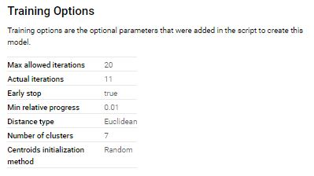
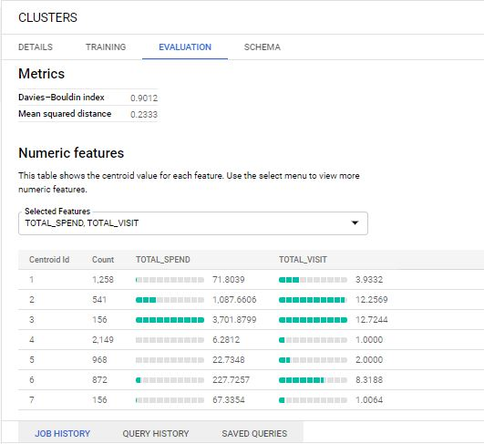

#   Homework 6 Customer Segmentation

Name : Nattakit Keawwilai        6220422030
#### Dataset : CSV file Retail Supermarket.

#### Method : 
1) Upload data to Google Bigquery 
2) Data preparation process to do Aggregate data and created data feature to created K-mean clustering model.

Selected 2 Features : TOTAL SPEND & TOTAL VISIT 

