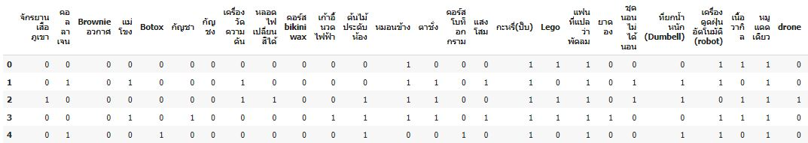
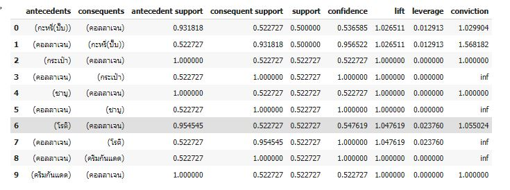
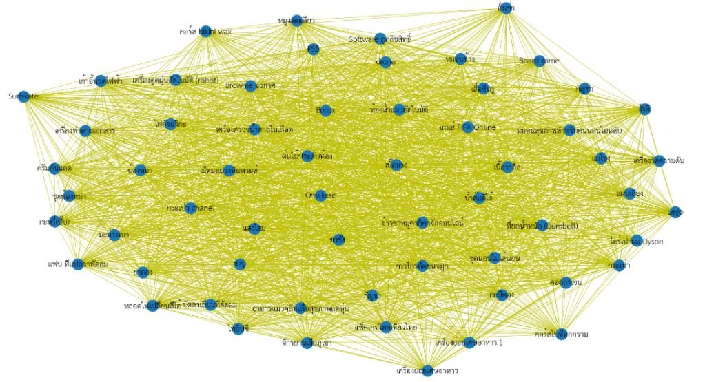

#   Homework 7 Product Recommendation

Name : Nattakit Keawwilai        
ID : 6220422030
#### Dataset : Customer Survey from students BADS CRM Analytics 

#### Data Preparation 
1. Remove missing values and Duplicated Handling 
2. Encoding value : 'Yes' => 1  , 'No' => 0 

#### Association Rules 

Find Association rule of items those are frequent items set at minimum support = 0.5 and Lift > 1

### colab Result : [Product Recommendation](https://github.com/NKSnack/BADS-7105/blob/main/Homework%2007/Product_Recommendation.ipynb)

## Graph network show the relationship on each pair of items

