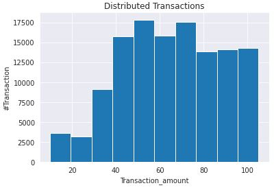
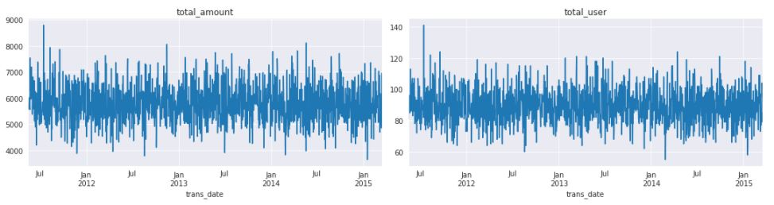
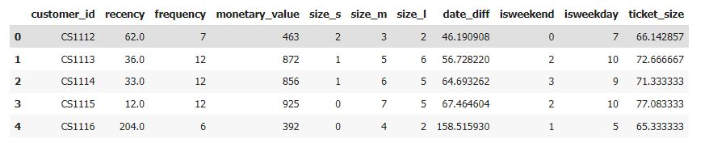
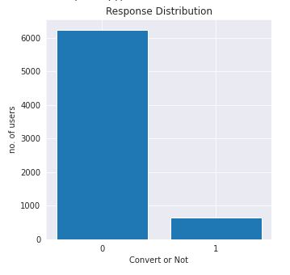

#   Homework 8 Campaign Response

Name : Nattakit Keawwilai        
ID : 6220422030
#### Dataset : Customer Survey from students BADS CRM Analytics 

#### Topic : Improvement Model accuracy rate and baseline model performance by machine learning techniques.

### Data Exploratory
### Distirbuted total transaction amount

#### Total amount and Total customer by time

### Data Preparation
### create data set with RFM variables

### Created feature as below
1. transaction amount on Weekend/Weekday
2. transaction define Size of Amount (S,M,L)
3. date between previous purchased
4. monetary_value
5. Frequency

### Calculating response rate
### Imbalance campaign response data with label

## Data Re-sampling
Under Sampling
Over Sampling
SMOTE
SMOTE-Tomek Links

## Model Improvement
#### 1.Logistic Regression
#### 2.XG-Boost

## Result
### Logistic Regression
| Resampling Method| Train max | Test max |
|------------------|-----------|----------|
|  Under sampling  |   0.63    |   0.65   |
|  Over sampling   |   0.63    |   0.65   |
|      Smote       |   0.63    |   0.65   |
### XG-Boost
| Resampling Method| Train max | Test max |
|------------------|-----------|----------|
|  Under sampling  |   0.65    |   0.64   |
|  Over sampling   |   0.68    |   0.67   |
|      Smote       |   0.90    |   0.90   |

### According accuracy result table at XG-Boost model and Re-sampling by SMOTE provide the best perfromance of model at accuracy about 0.90 and cross vadiation can be increased the model performance.
